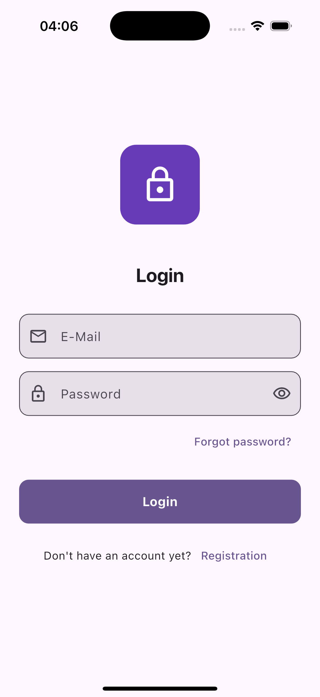
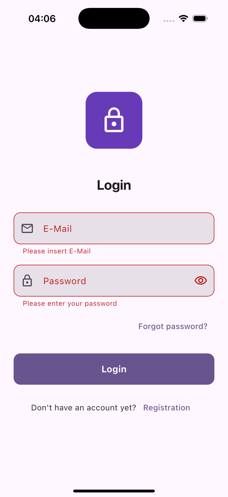

# Flutter Login Screen Template

## Free preview – full UI kit on Gumroad

Clean and responsive login screen template built with **Flutter** and **Material 3**.

Designed for **MVPs**, **prototypes**, and quick project setups where you need a solid authentication UI without backend logic.

---

## ✨ Features

- Material 3 design
- Responsive layout (mobile & tablet)
- Light and dark mode
- Clean, readable Flutter code
- No backend or authentication logic included

---

## 📸 Screenshots

---

## 📦 Full Version

The complete template, including full source code and documentation, is available here:

👉 **https://griseo.gumroad.com/l/dev-flutter-login-template**

---

## ℹ️ Notes

This repository is intended as a **preview and showcase**.  
No source code is included here.

---

## 🛠 Built With

- Flutter
- Material 3
